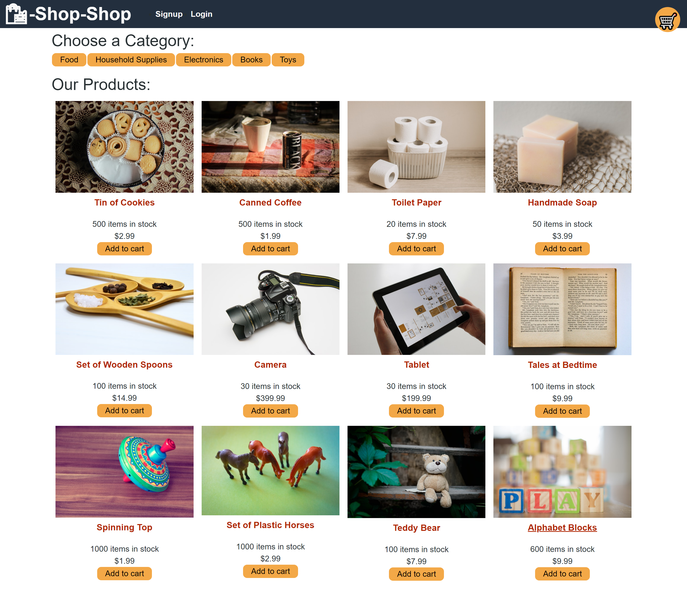

# Ecommerce Shop

[](https://opensource.org/licenses/MIT)


<p align="center">
    
    
    
    
    
    
    
</p>
   

# Description
The Ecommerce Shop application allows users to shop online from various productes that have been seed through MongoDB and GraphQL. Users can sign up or create a new account. Once logged in users can add product and view them. 


## Table of Contents
- [Overview](#overview)
- [Authors](#authors)
- [Demo](#demo)
- [Preview](#preview)
- [Features](#features)
- [Installation](#installation)
- [Contribution](#contribution)


## Authors
 - Author: Sophia
 - GitHub: [soph-k](https://github.com/soph-k)
 - Version 1.1


## Demo
[Demo Heroku](https://sophk-tech-blog.herokuapp.com/)


## Preview



## Repo
[Repo](https://sophk-ecommerce-shop.herokuapp.com/)


## Features
- HTML
- CSS
- Javascript 
  - React
- Node.js 
  - Express
- GraphQL
- Mongodb


## Installation
Before using commands please be sure that NodeJS packages are installed. 
If not, run the following commands in the following order: 
```
npm i
```


## Usage
Once all of the files and packages are install.
Run your establish a connection to the database, seed your 
data and run the client side.
```
npm run start (run client side)
```
```
node server.js (run server)
```
```
npm run seed (run seed database)
```

## Contribution
Contributions are accepted. Feel free to fork without permission.


## License
This project is under the MIT license.


### Questions
For questions about this project, please review my GitHub repo at [soph-k](https://github.com/soph-k) or contact me on Github.


#### Bugs 
- No known bugs.

